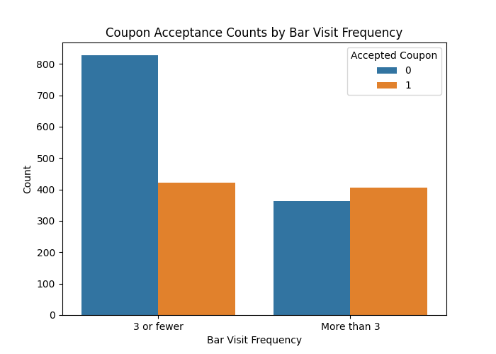
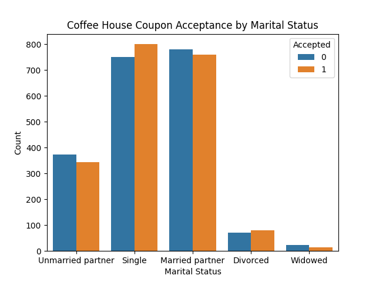
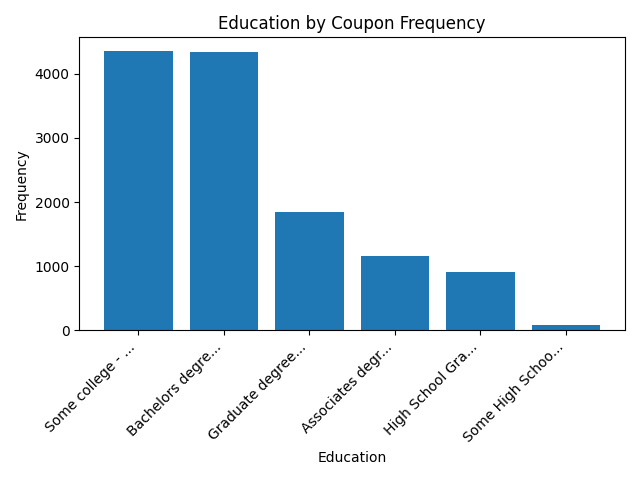
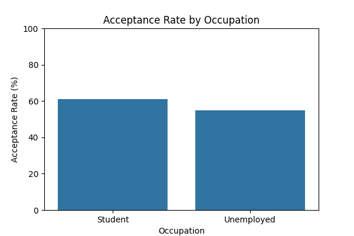
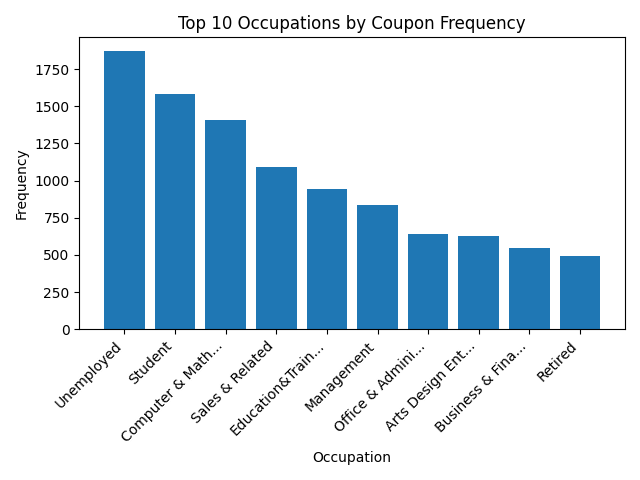
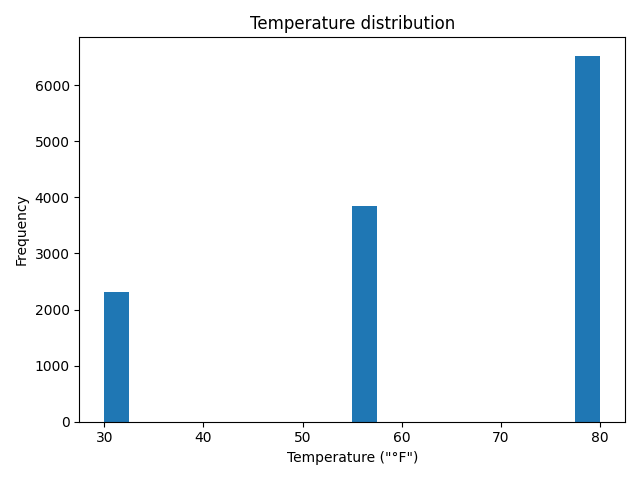
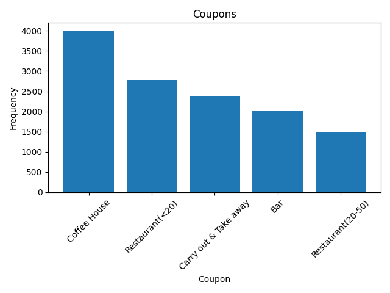
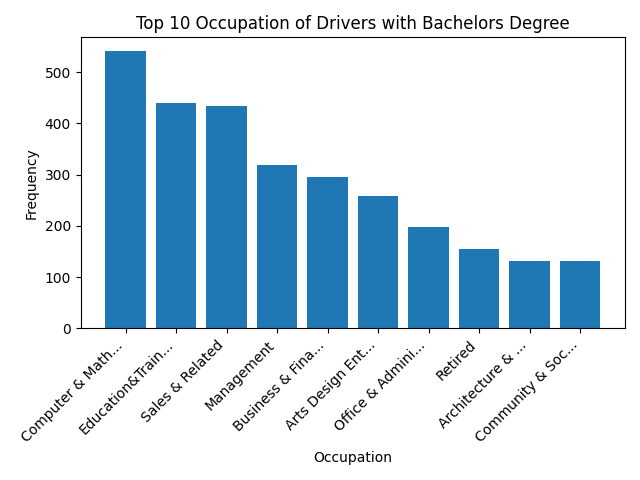

# Coupon Acceptance Analysis

This project analyzes factors influencing coupon acceptance behavior among drivers, with a particular focus on bar coupon acceptance patterns.

## Key Findings

### Overall Acceptance Rates
- 41% of bar coupons were accepted overall
- 34% of bar coupons were accepted for those who went to a bar 3 or fewer times

### Demographic and Behavioral Factors

#### Age and Bar Frequency
- 62% acceptance rate for drivers over 25 who go to bars more than once a month
- 55% acceptance rate for drivers under 25 or who go to bars less often
- 7% difference between these two groups

#### Passenger and Occupation Factors
- 59% acceptance rate for drivers who:
  - Go to bars more than once a month
  - Had passengers who were not kids
  - Had occupations other than farming, fishing, or forestry
- 56% acceptance rate for all others
- 3% difference between these groups

#### Other Notable Segments
- 57% acceptance rate for drivers who:
  - Go to bars more than once a month
  - Not with kids
  - Not widowed
- 57% acceptance rate for drivers who:
  - Go to bars more than once a month
  - Are under 30
- 61% acceptance rate for drivers who:
  - Have income > $100K
  - Visit cheap restaurants more than 4 times

### Marital Status Impact

Drivers with partners demonstrate substantially higher acceptance rates compared to those who are single, widowed, or divorced.

### Education Level Analysis

Individuals with 'Some college - no degree' or a 'Bachelor's degree' show the highest acceptance rates among all education levels.

### Occupation Analysis

Drivers who are either students or unemployed exhibit significantly higher coupon acceptance rates than drivers in other occupational categories.

## Temperature Distribution

## Coupon Frequency

## Additional Insights

## Conclusion

This analysis reveals several key factors that influence coupon acceptance behavior, including bar visit frequency, age, marital status, education level, and occupation. These insights can be valuable for targeting specific customer segments with tailored marketing strategies to increase coupon acceptance rates.
